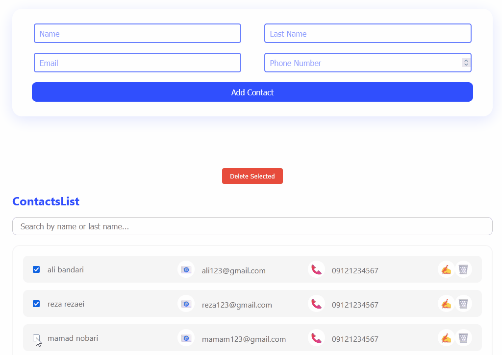

# Contacts App

  

A simple React application for managing contacts. You can add, edit, delete, and search contacts by name or last name. The project demonstrates clean component structure and state management using the Flux architecture pattern via React Context.

  

## Architecture

  

This project uses the **Flux architecture** for state management. The core contact data and actions are managed in a central context (`ContactContext`), which acts as a single source of truth for the app. Components dispatch actions to update the state, and the UI reacts to state changes, following the unidirectional data flow principle of Flux.

  

## Features

  

- Add new contacts (name, last name, email, phone)
  


- Validate Form Data
  


- Edit existing contacts
  


- Delete single contact
  


- Delete multiple contacts (with confirmation modal)
  


- Search contacts by name or last name (Typesense /client-side, instant filtering)
  


- Modular, reusable React components

- Styled with CSS modules for encapsulated styles

  

## Getting Started

  

### Prerequisites

- Node.js (v16 or newer recommended)

- npm (comes with Node.js)

  

### Installation & Running

  

1.  **Clone the repository:**

```sh

git clone https://github.com/marezayeye/mohammadreza-pouladvand_week17.git

cd mohammadreza-pouladvand_week17

```

2.  **Install dependencies:**

```sh

npm install

```

3.  **Start the development server:**

```sh

npm run dev

```

4. Open your browser and go to `http://localhost:5173` (or the port shown in your terminal).

  
  
  

## Used npm Modules

-  [concurrently ](https://www.npmjs.com/package/concurrently)  (for running json server and project simultaneously)

-  [uuid ](https://www.npmjs.com/package/uuid) (for generating valid and unique ids when mapping)

-  [json-server ](https://www.npmjs.com/package/json-server) (to serve as a mock back-end in order to save/read data)

-  [Formik](https://www.npmjs.com/package/formik)(used to Handle forms with ease)

-  [yup](https://www.npmjs.com/package/yup)(Validate Form data on client-side)
